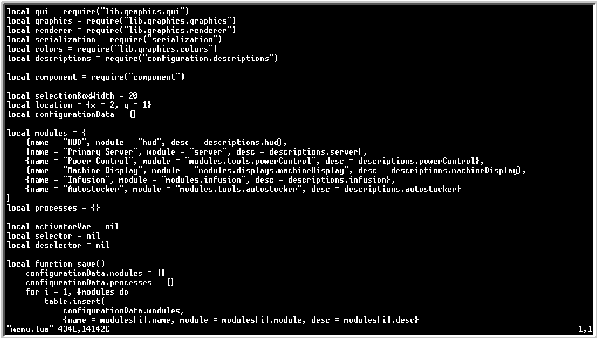
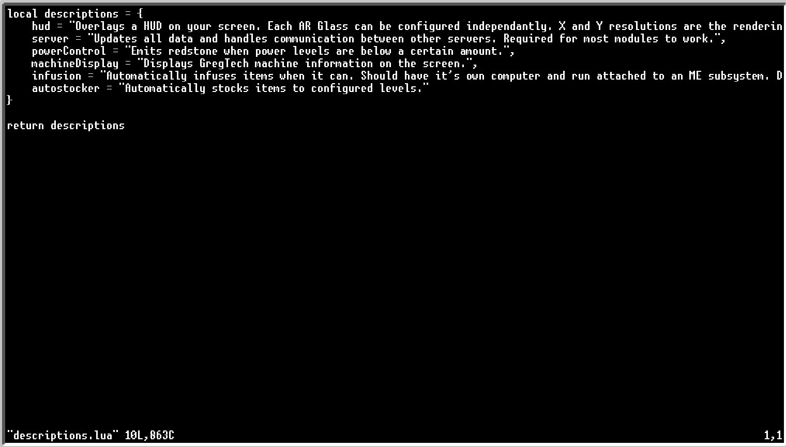

# NIDAS Ore Processing
 This is a module for [NIDAS](https://github.com/S4mpsa/NIDAS), a piece of software for the OpenComputers Minecraft mod.

## Features
* Sorts incoming ores to be processed as the user desires, using 7 different processing chains
* Provides a GUI to easily add, modify, and remove filters
* Provides in-game disableable help text to assist in setup

## Setup
 First, ensure that you have the NIDAS dev branch installed on your OpenComputer:
* Ensure your computer is equipped to run NIDAS. It is recommended that you follow the instructions on the NIDAS repo page.
* Download NIDAS's `setup` file through the OC shell:
    ```
    wget https://raw.githubusercontent.com/S4mpsa/NIDAS/master/setup.lua -f
    ```
* Then run `setup` on your machine, ensuring you put `dev` in to specify the dev branch:
    ```
    setup dev
    ```
 NIDAS is now installed on your computer.
* Next, download the NIDAS Ore Processing setup file:
    ```
    wget https://raw.githubusercontent.com/Aurastorm/NIDAS-Ore-Processing/main/installOreProc.lua -f
    ```
* Then run it:
    ```
    installOreProc
    ```
 Your computer will then restart and you should see the `Ore Processing` module in the `Available Modules` list to be activated and configured.

## Alternate Setup 
 If using the NIDAS Ore Processing setup file breaks things in your NIDAS install for some reason or if you (or Sampsa) already added another module to NIDAS, you may need to manually install the module yourself. Here's how:

* Install NIDAS as before.
* Navigate to the modules folder (click the `Shell` button to access the shell):
    ```
    cd /home/NIDAS/modules/tools
    ```
* And download the module:
    ```
    wget https://raw.githubusercontent.com/Aurastorm/NIDAS-Ore-Processing/main/OreProcessing.lua -f
    ```
* Next, navigate to the configuration folder:
    ```
    cd /home/NIDAS/configuration
    ```
* And open `menu.lua`:
    ```
    edit menu.lua
    ```
 
* Add a comma to the last entry in `modules` and add the line:
    ```
    {name = "Ore Processing", module = "modules.tools.OreProcessing", desc = descriptions.OreProcessing}
    ```
    as the line after that.
* Save (Ctrl-S) and quit (Ctrl-W) and open the `descriptions.lua` file:
    ```
    edit descriptions.lua
    ```
 
* Same as before, add a comma to the last entry in `descriptions` and add the following line after it:
    ```
    OreProcessing = "Automatically sorts incoming ores into their respective configurable ore processing lines."
    ```
* Save and quit, then `reboot`. You should now see the `Ore Processing` module.